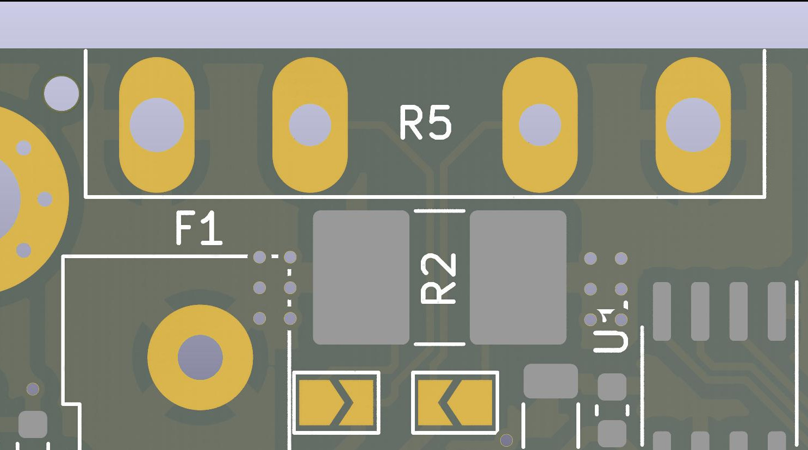

# Tripple Current Shunt

This is a small PCB project to measure current consumption and voltages in a multi battery camper van environment.

To do this it hosts three [INA219](https://www.ti.com/product/INA219) power monitors,
one [ADS1015](https://www.ti.com/product/ADS1015) four channel ADC to measure ground offsets,
one [MCP9808](https://www.microchip.com/en-us/product/MCP9808) temperature sensor and
a [M24C02](https://www.st.com/en/memories/m24c02-r.html) EEPROM to store calibration data.

## Interfaces

The board has three different interfaces. A [I2C](#i2c) digital interface for reading the measurements.
Three [Current Inputs](#current-input)
to measure the current flows into and out of the batteries. Three [Voltage Inputs](#voltage-input) to measure the ground
offset of the batteries.

### I2C

The I2C interface is wired to two JST-PH connectors with a pin-out compatible
to [Adafruits Stemma](https://learn.adafruit.com/introducing-adafruit-stemma-qt/technical-specs) connection. The
footprint also fits the connector and pin-out
of [Seedstudios Grove System](https://wiki.seeedstudio.com/Grove_System/#grove-i2c). The two connectors are wired in
parallel to allow for daisy-chaining. The power is also supplied via this connector (from rev2 onwards).

#### I2C Addresses

The six I2C slaves on the board are configured to follow a schema where the lowest two bits of the address are defined
per board. This allows usage of up to four boards with a total of 12 channels on a single bus. The individual addresses
are listed below. *xx* marks the bits set via jumpers (see screenshot below).

| Device      | Address      |
|-------------|--------------|
| MCP9808     | 0b001_10*xx* |
| INA219 Ch A | 0b100_00*xx* |
| INA219 Ch B | 0b100_01*xx* |
| ADS1015     | 0b100_10*xx* |
| INA219 Ch C | 0b100_11*xx* |
| M24C02      | 0b101_10*xx* |

|                                                                                                                                      |
|--------------------------------------------------------------------------------------------------------------------------------------------------------------------------------------------------------|
| There should always be one of JP1, JP2, JP3 or JP4 closed. Then close JP11 or JP12 when the matching box is filled. To select for example the address *10* for the board you would close JP3 and JP12. |

### Current Input

The current inputs are connected inline between the batteries and the consumers. They can be connected using
either [Wago 2604-1103 terminal blocks](https://www.wago.com/global/pcb-terminal-blocks-and-pluggable-connectors/pcb-terminal-block/p/2604-1103)
or a single row terminal block with 5mm pin spacing.

The board offers the option to place a [miniOTO fuse holder](https://imaxx.nl/product/minioto-holder-h7810/) in line to
protect the board and connections.

The current is then converted to a voltage using a current shunt. The different options for this are described
in ["Choosing a Shunt Resistor"](#choosing-a-shunt-resistor).

### Voltage Input

To measure the voltage offset between the board ground and the battery ground the connector used for
the [Current Input](#current-input) offers an extra connection. The input can tolerate a maximum voltage of ±20V but can
only measure about a ±5V offset. This can easily be adapted to other needs,
see [Adapting Voltage Dividers](#adapting-voltage-dividers).

## Design considerations

The board is designed to be easily adaptable to different situations. The easiest adaptions are to just leave parts out:

* Remove the fuse holders (e.g. because you already have a fuse box), and bridge that footprint
* Remove the temperature sensor and/or EEPROM to save cost
* Remove the EMI filter by not populating the capacitors and bridging the ferrite-beads

For the more complex considerations see below:

### Choosing a Shunt Resistor

**1. Choosing a footprint:** The board offers four different footprints for the shunt resistors:

* Single-Inline 4-pin through-hole
  for [Isabellenhütte PBV](https://www.isabellenhuette.de/fileadmin/user_upload/PBV.PDF) resistors
* SMD 2512 resistors
* SMD 1206 resistors
* Off-Board Shunt like [Vishay RTOP](https://www.vishay.com/product/50045/)

When using any other resistor footprint then the Single-Inline one the two jumpers next to the resistor footprints needs
to be closed. This connects the voltage sense terminals to the current terminals.

The screenshot shows the resistor footprints for channel A. R5 is for the *Single-Inline 4-pin through-hole* and R2 for
either SMD 2512 or SMD 1206. To use an external shunt do not populate any of the two. If you want to use any shunt that
is not the Single-Inline 4-pin close the two jumpers below R2.

**2. Check maximum values:** Calculate the maximum resistor value for a given current and power rating:

$R \leq \frac{P}{I^2}$

**3. Check voltage over shunt:** The INA219 can work with up to 26V but can measure a either ±40mV, ±80mV, ±160mV or
±320mV of shunt voltage. Using a lower shunt voltage will give a lower power loss on the shunt while aiming for a higher
shunt voltage increases signal-to-noise ratio.
You can calculate the voltage over the shunt by $U_{shunt}=R_{shunt} \cdot I$.

**Note:** Check whether the trace width is sufficient for your current. You can add extra solder and copper to the
traces on the bottom side to improve the current capabilities.

### Adapting Voltage Dividers

The voltage dividers for the ground offset are set to allow for ±5V input. This is achieved by building a voltage
divider between the input voltage and 5V. The output voltage can then be calculated by:

$U_{out} = \frac{5V + U_{in}}{2}$

There are however footprints to form a voltage divider between the input and ground. So it could be used to measure
another bus voltage.

**Note:** When adapting this take care to not overload the clamping diodes or the resistors in the voltage divider.

### Adapting Low Pass Filters

The current and voltage inputs host capacitors to form RC low-pass filters. The calculations for these can be found in
the schematic.

# License

Licensed under the CERN Open Hardware Licence Version 2 - Permissive.
Unless you explicitly state otherwise, any contribution intentionally submitted by you, shall be licensed as above,
without any additional terms or conditions.